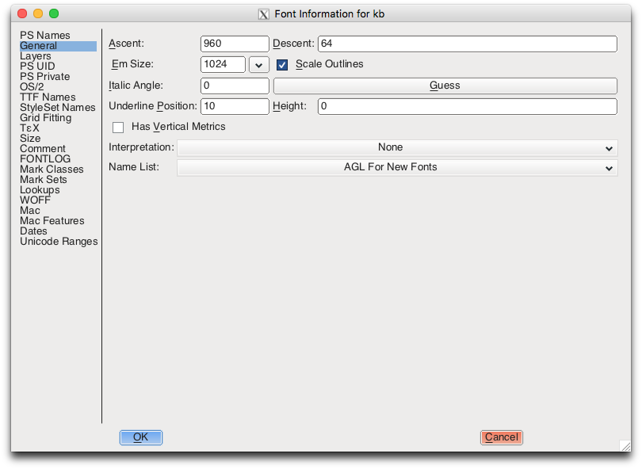
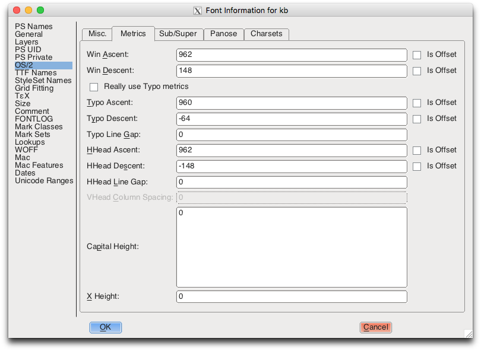

# Icon Generation Notes

## Sketch

- Sketch layers need to have an `icon area` set to `Transparent`. If the Layer is not transparent, then Sketch will invert the icon colors due to the Even Odd fill rule on the entire icon.
  - Good article on SVG exports from Sketch with a section on how fill rules work: [https://medium.com/sketch-app-sources/preparing-and-exporting-svg-icons-in-sketch-1a3d65b239bb](https://medium.com/sketch-app-sources/preparing-and-exporting-svg-icons-in-sketch-1a3d65b239bb)
- SVG Optimization. Sketch produces very bloated and unoptimized SVGs, thankfully downloading from Zeplin will automatically run the Sketch SVGs through [SVGO](https://github.com/svg/svgo) which optimizes the markup.
  - If icons downloaded from Zeplin look different from the Sketch icons, look at the downloaded SVGs for the following attributes: `fill-rule` being set to something that is not `even-odd` and `path` having `fill` set

## Webfonts Generator

The [webfonts-generator](https://github.com/sunflowerdeath/webfonts-generator) library works by using the following dependencies to convert a series of svg files into webfonts

- `svg` - [svgicons2svgfont](https://github.com/nfroidure/svgicons2svgfont)
- `ttf` - [svg2ttf](https://github.com/fontello/svg2ttf)

**Important svg configuration**

- `fontSize` must be set to a power of 2 larger than `1000`. This is because any font size (same as the em square value) below `1000` will lead to inaccurate svg paths (looks lumpy or rounded). See this [issue on a discussion of font size issues](https://github.com/jesseweed/seti-ui/issues/401).
- `descent` must be set to `0`. This is because `svgicons2svgfont` has poor `ascent/descent` calculations which can put icons on a half pixel boundry for its grid size, leading to anti-aliasing which causes blurriness.

## Font Forge

Font Forge exposes a [custom scripting language](https://fontforge.github.io/en-US/documentation/scripting/native/) for applying operations to font files. This is used is `desktop/yarn-helpers/font.js` to run a subprocess that will operate on the TTF font from webfonts-generator to tweak some font header values.

**Keyboard Shortcuts**

- `CTRL + O` Open a font file (`client/shared/images/fonts/kb.ttf`)
- `CTRL + SHIFT + >` Jump to a specific icon. You can filter by icon name (`1-kb-iconfont-add-16`) or by unicode value (`uniE900`).
- `CTRL + SHIFT + F` To open the font preferences (Ascent, Descent, OS/2, Metrics, GASP)

**Ascent/Descent**

- [What is Ascent/Descent?](https://stackoverflow.com/questions/27631736/meaning-of-top-ascent-baseline-descent-bottom-and-leading-in-androids-font/27631737#27631737)
- General Ascent and Descent Values can be set under "General".

**OS/2 Headers**

- OS/2 > Metrics will set WinAscent and WinDescent which also affect positioning

**"Grid Fitting" GASP Table**

- The [GASP table](https://docs.microsoft.com/en-us/typography/opentype/spec/gasp) sets grid fitting properties on the flag. It's important to use GASP version 1.0
- Unfortunately, by default Font Forge supports version 0, this is seen by looking at the [documentation](https://fontforge.github.io/en-US/documentation/scripting/native/scripting-alpha/#SetGasp) for the `SetGasp()` function. This function takes a number as the second argument indicating the flag for the GASP Table.
- In order to set values for Version 2.0, manually set a number in the range [7, 15].
- Unforunately values larger than 3 are not documented by Font Forge.
- The last and only row should have a pixel value of `65535`.
- We want to set all the fields in the GASP table, so we use `SetGasp(65535, 15)` to do so.
