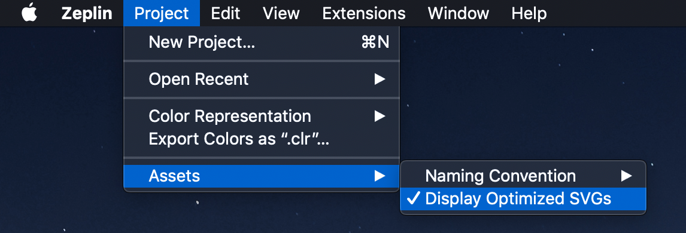

## Building Keybase Icon Font

### Dependencies

[webfont-generator](https://github.com/sunflowerdeath/webfonts-generator)

[fontforge](https://fontforge.github.io/en-US/downloadsj)

- Mac: `brew install fontforge`
- Window: Install the GUI application and the executable should be available via
  the command line.

### Other Documentation

[Sketch Best Practices for SVG Export](./SKETCH.md)

[Using Font Forge to Inspect Icon Font Output](./FONTFORGE.md)

### Instructions

**Building Iconfont From Zeplin**

1. Delete all icons from this folder
2. Make sure you have `Display Optimized SVGs` selected in Zeplin (under Project > Assets on MacOS) 
   
3. Download iconfont svgs from this [zeplin sheet](https://zpl.io/29y4w5w)
4. Optionally if there are PNG assets to update, download from this [zeplin sheet](https://zpl.io/VQoMDq4)
   - Note: **Make sure you scroll all the way to the bottom of the asset panel on the right of the Zeplin sheets before exporting the assets, otherwise they might not load.**
5. Move assets to the appropriate directory
   - svg iconfonts: `client/shared/images/iconfont`
   - png assets: `client/shared/images/icons`
6. Generate the iconfont and update constants on both apps
   - `yarn update-icon-font` Will generate a font file and update the constants
     - font: `client/shared/fonts/kb.ttf`
     - constants: `client/shared/common-adapters/icon.constants`
   - `yarn update-icon-constants` will only update the constants

**Testing A Single SVG**

If you're modifying a single Sketch asset and want to see how the iconfont looks without uploading and redownloading from Zeplin, do the following:

1. In Sketch, right-click on the top folder for the icon and `Copy SVG Code`
2. Paste the SVG code into the matching svg file located in `client/shared/images/iconfont/{counter}-kb-iconfont-{name}-{size}.svg`
3. Install `svgo` to manually optimize the SVG output from Sketch. This is exactly what Zeplin does before exporting assets as SVG
4. Rewrite the SVG file `svgo -i {counter}-kb-iconfont-{name}-{size}.svg -o {counter}-kb-iconfont-{name}-{size}.svg`
5. Update the iconfont `kb.ttf` with `yarn update-icon-font`
6. The iconfont should now reflect the single SVG change. **Do not let the Sketch file(s) and the committed SVG assets get out of sync when testing a single SVG**

### How SVGs Are Generated

The complete SVG pipeline is as follows

Sketch Assets → Zeplin → Export to SVG → Optimized with SVGO → Download

It's important to note that the original Sketch assets determine the final SVG
output after running through SVGO. Pay attention for strange overlapping/masking
paths in the final SVGs or inverted colors. This is usually caused by something
happening in Sketch.

The naming convention of the SVG files is very important.

`{counter}-kb-inconfont-{name-with-dashes}-{size}.svg`

The counter is used to generate the unicode values for the characters in the
iconfont. It is okay to have gaps in the counters. It is NOT ok to have
multiple icons with the same counter.

For instructions on adding/modifying icons look at the instructions in this
[zeplin sheet](https://zpl.io/29y4w5w).

### Common Errors

1. Flow: `Cannot create Kb.Icon element because property 'iconfont-{name}' is missing in object [1] in property 'type'`

   - This happens when an icon name reference via the `type` prop on a `Kb.Icon` component, but Flow cannot find the matching `type` in `icon.constants.js`
   - Check the naming of the correct file in `images/iconfont/*.svg`
   - Also ensure that the key in the object was not deleted on accident.

2. Icon name doesn't match the icon being rendered.

   - This can happen if there are multiple SVGs in this folder with the same counter - for example, if some icons were removed and others were added with their number.
   - Ensure there are no duplicate counters in the SVG set.
