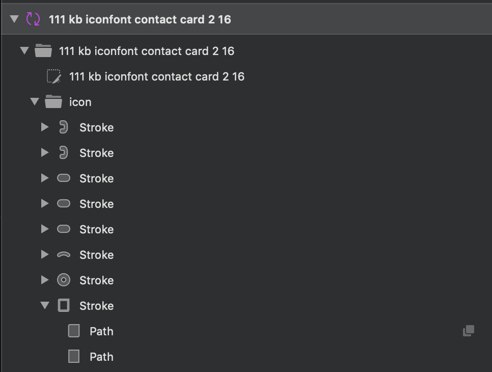
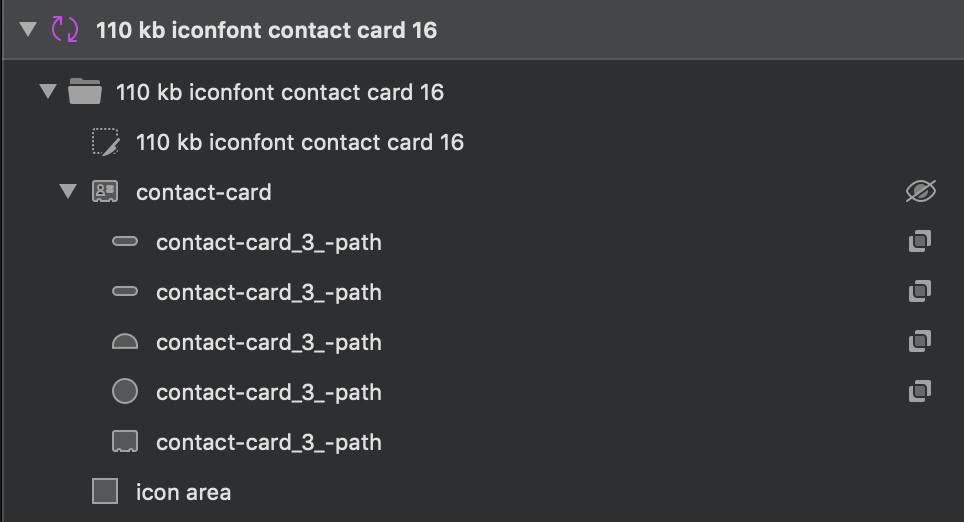

## Sketch Best Practices for SVG Export

The Sketch assets for each icon directly determine the final SVG output that is used to generate the iconfont `kb.ttf`. If there are issues with the colors/curves of the SVG files, then it likely caused by Sketch or the SVGO optimizations done by Zeplin.

### Fill-rule - even-odd v.s. non-zero

When two distinct `path` elements of an SVG overlap, there are two different ways the itersection can be handled using the `fill-rule` property of SVG groups (`g` element).

Reference: [The Winding Order of the Fill Rule](https://oreillymedia.github.io/Using_SVG/extras/ch06-fill-rule.html)

Reference: [MDN fill-rule page](https://developer.mozilla.org/en-US/docs/Web/SVG/Attribute/fill-rule)

**evenodd**

> The value evenodd determines the "insideness" of a point in the shape by drawing a ray from that point to infinity in any direction and counting the number of path segments from the given shape that the ray crosses. If this number is odd, the point is inside; if even, the point is outside.
>
> Source: https://developer.mozilla.org/en-US/docs/Web/SVG/Attribute/fill-rule#evenodd


**nonzero**
> The value nonzero determines the "insideness" of a point in the shape by drawing a ray from that point to infinity in any direction and then examining the places where a segment of the shape crosses the ray. Starting with a count of zero, add one each time a path segment crosses the ray from left to right and subtract one each time a path segment crosses the ray from right to left. After counting the crossings, if the result is zero then the point is outside the path. Otherwise, it is inside.
>
> Source: https://developer.mozilla.org/en-US/docs/Web/SVG/Attribute/fill-rule#nonzero


In Sketch it's possible to set the fill-rule on both the  the `icon area` and the icon's `path` layer, which will determine the fill-rule on the final SVG group.


### Layers

It's very important that the strokes, shapes, and paths used to create the icon are combined into a single layer using `union`, `subtract`, `intersection` etc.

This ensures a single combined layer for the icon will be exported as **one SVG `path` element**.

**Not Combined**



**Combined**



### Checking SVG Output For Combined `path`

To check if Sketch is correctly combining the layers and exporting as a single `path` element, simply right click on the top folder for the icon in Sketch and choose `Copy SVG Code`. Paste the SVG code into any text editor and count the number of `path` elements - making sure that they algin with what is rendered in Sketch.

**Combined Path**

```html

<svg width="16px" height="16px" viewBox="0 0 16 16" version="1.1" xmlns="http://www.w3.org/2000/svg" xmlns:xlink="http://www.w3.org/1999/xlink">
    <g id="Symbols" stroke="none" stroke-width="1" fill="none" fill-rule="evenodd">
        <g id="51-kb-iconfont-identity-reddit-16">
            <g id="kb-iconfont-identity-reddit-16">
                <g>
                    <rect id="icon-area" fill="#D8D8D8" opacity="0" x="0" y="0" width="16" height="16"></rect>
                    <path d="M8,16 C12.418278,16 16,12.418278 16,8 C16,3.581722 12.418278,0 8,0 C3.581722,0 0,3.581722 0,8 C0,12.418278 3.581722,16 8,16 Z M1.68782196,8.56226263 C1.81704765,8.78524 1.98184965,8.96163289 2.19269156,9.09091789 C2.1696716,9.25527211 2.15763844,9.39659579 2.15763844,9.52588079 C2.15763844,10.0545361 2.31040728,10.5596374 2.60391178,11.0296695 C2.90944945,11.5112168 3.34368963,11.9341411 3.90767869,12.2984421 C4.44760142,12.6507045 5.07018674,12.9328284 5.7628783,13.1207366 C6.46760303,13.3086447 7.20738088,13.4028605 7.97070187,13.4028605 C8.73402286,13.4028605 9.47380071,13.3086447 10.1664923,13.1207366 C10.871217,12.9328284 11.4938023,12.6507045 12.045235,12.2984421 C12.6092241,11.9341411 13.0319543,11.5112168 13.3369688,11.0296695 C13.6309965,10.5596374 13.7832421,10.0545361 13.7832421,9.52588079 C13.7832421,9.39659579 13.7717321,9.26731079 13.748189,9.12598711 C13.9830972,8.99670211 14.1594092,8.82083263 14.3001449,8.58581658 C14.4293706,8.36231579 14.5,8.11578447 14.5,7.84569921 C14.5,7.43429026 14.3587411,7.08202789 14.0652366,6.78838868 C13.7832421,6.49474947 13.4311413,6.35342579 13.0199211,6.35342579 C12.6327672,6.35342579 12.3157196,6.48271079 12.033725,6.72924211 C11.0119527,6.07182526 9.79084836,5.70752421 8.35837894,5.64890105 L9.12117675,3.24011737 L11.1882646,3.73370342 C11.1882646,4.06241184 11.3174903,4.35605105 11.5523986,4.59106711 C11.7873068,4.82608316 12.0687782,4.94385289 12.409369,4.94385289 C12.7384498,4.94385289 13.0199211,4.82608316 13.2668625,4.57955184 C13.5017708,4.34453579 13.6189633,4.05089658 13.6189633,3.71014947 C13.6189633,3.38091763 13.5017708,3.09931711 13.2668625,2.85226237 C13.0199211,2.61724632 12.7384498,2.5 12.409369,2.5 C12.1629507,2.5 11.9395525,2.57066184 11.7281874,2.69994684 C11.5288554,2.84074711 11.3760866,3.01714 11.281914,3.24011737 L9.00398422,2.69994684 C8.94538796,2.68790816 8.88679169,2.68790816 8.82767225,2.72350079 C8.76907598,2.75857 8.7219897,2.80567789 8.71047972,2.86430105 L7.82944301,5.63686237 C6.32634417,5.66041632 5.03461043,6.02471737 3.95424179,6.71772684 C3.66073728,6.47119553 3.34368963,6.35342579 2.9795557,6.35342579 C2.56885866,6.35342579 2.21623471,6.49474947 1.93476336,6.78838868 C1.64125885,7.08202789 1.5,7.43429026 1.5,7.84569921 C1.5,8.10426921 1.55859627,8.33928526 1.68782196,8.56226263 L1.68782196,8.56226263 Z M5.41077753,9.45521895 C5.58656632,9.63161184 5.79793142,9.71378895 6.05638281,9.71378895 C6.29129105,9.71378895 6.50265615,9.63161184 6.67896813,9.45521895 C6.85475692,9.27882605 6.94892949,9.06736395 6.94892949,8.82083263 C6.94892949,8.57377789 6.85475692,8.36231579 6.67896813,8.18644632 C6.50265615,8.01005342 6.29129105,7.91583763 6.05638281,7.91583763 C5.80996458,7.91583763 5.59859948,8.01005342 5.41077753,8.18644632 C5.23446555,8.36231579 5.14029298,8.57377789 5.14029298,8.82083263 C5.14029298,9.06736395 5.23446555,9.27882605 5.41077753,9.45521895 L5.41077753,9.45521895 Z M5.90361397,11.3819318 C6.33837733,11.8163713 7.0310689,12.0278334 7.99424501,12.0278334 L8.00575499,12.0278334 C8.9689311,12.0278334 9.66162267,11.8163713 10.0958628,11.3819318 C10.1429491,11.3348239 10.1664923,11.2762008 10.1664923,11.1940237 C10.1664923,11.1233618 10.1429491,11.0647387 10.0958628,11.0176308 C10.0492997,10.9705229 9.9901803,10.9469689 9.92007405,10.9469689 C9.84944462,10.9469689 9.79084836,10.9705229 9.74376207,11.0176308 C9.40317128,11.3583779 8.82767225,11.5227321 8.00575499,11.5227321 L7.99424501,11.5227321 C7.17232775,11.5227321 6.59682872,11.3583779 6.25623793,11.0176308 C6.20915164,10.9705229 6.15055538,10.9469689 6.07992595,10.9469689 C6.00929652,10.9469689 5.95070026,10.9705229 5.90361397,11.0176308 C5.85705087,11.0647387 5.83350773,11.1233618 5.83350773,11.1940237 C5.83350773,11.2762008 5.85705087,11.3348239 5.90361397,11.3819318 L5.90361397,11.3819318 Z M9.32103187,9.45521895 C9.49734385,9.63161184 9.70870895,9.71378895 9.96716033,9.71378895 C10.2015454,9.71378895 10.4134337,9.63161184 10.5892225,9.45521895 C10.7655344,9.27882605 10.8591838,9.06736395 10.8591838,8.82083263 C10.8591838,8.57377789 10.7655344,8.36231579 10.5892225,8.18644632 C10.4134337,8.01005342 10.2015454,7.91583763 9.96716033,7.91583763 C9.72021893,7.91583763 9.50885383,8.01005342 9.32103187,8.18644632 C9.1447199,8.36231579 9.05107051,8.57377789 9.05107051,8.82083263 C9.05107051,9.06736395 9.1447199,9.27882605 9.32103187,9.45521895 L9.32103187,9.45521895 Z" id="Icon-reddit" fill="#000000"></path>
                </g>
            </g>
        </g>
    </g>
</svg>
```

**Uncombined Path**

```html

<svg width="16px" height="14px" viewBox="0 0 16 14" version="1.1" xmlns="http://www.w3.org/2000/svg" xmlns:xlink="http://www.w3.org/1999/xlink">
    <g id="Symbols" stroke="none" stroke-width="1" fill="none" fill-rule="evenodd">
        <g id="111-kb-iconfont-contact-card-2-16" transform="translate(0.000000, -1.000000)" fill="#000000" fill-rule="nonzero">
            <g id="icon">
                <g transform="translate(0.000000, 1.000000)">
                    <path d="M12.5,12.5 L12.5,1.5 L3.5,1.5 L3.5,12.5 L12.5,12.5 Z M12.5,14 L3.5,14 C2.672,14 2,13.3728 2,12.6 L2,1.4 C2,0.6272 2.672,0 3.5,0 L14,0 L14,12.6 C14,13.3728 13.328,14 12.5,14 Z" id="Stroke"></path>
                    <path d="M8,7 C8.552,7 9,6.552 9,6 C9,5.448 8.552,5 8,5 C7.448,5 7,5.448 7,6 C7,6.552 7.448,7 8,7 Z M8,8.8 C6.45388745,8.8 5.2,7.54611255 5.2,6 C5.2,4.45388745 6.45388745,3.2 8,3.2 C9.54611255,3.2 10.8,4.45388745 10.8,6 C10.8,7.54611255 9.54611255,8.8 8,8.8 Z" id="Stroke"></path>
                    <path d="M11.4190056,9.34647724 C11.7799363,9.68822861 11.7954841,10.2578649 11.4537328,10.6187956 C11.1119814,10.9797263 10.5423451,10.9952741 10.1814144,10.6535228 C9.69681978,10.1946787 8.88973874,9.9 8.00021,9.9 C7.11068126,9.9 6.30360022,10.1946787 5.8190056,10.6535228 C5.45807495,10.9952741 4.88843861,10.9797263 4.54668724,10.6187956 C4.20493586,10.2578649 4.22048374,9.68822861 4.5814144,9.34647724 C5.41479852,8.55737782 6.66748806,8.1 8.00021,8.1 C9.33293194,8.1 10.5856215,8.55737782 11.4190056,9.34647724 Z" id="Stroke"></path>
                    <path d="M1.00021,4 C0.44792525,4 0.00021,3.55228475 0.00021,3 C0.00021,2.44771525 0.44792525,2 1.00021,2 L2.40021,2 C2.95249475,2 3.40021,2.44771525 3.40021,3 C3.40021,3.55228475 2.95249475,4 2.40021,4 L1.00021,4 Z" id="Stroke"></path>
                    <path d="M1.00021,8 C0.44792525,8 0.00021,7.55228475 0.00021,7 C0.00021,6.44771525 0.44792525,6 1.00021,6 L2.40021,6 C2.95249475,6 3.40021,6.44771525 3.40021,7 C3.40021,7.55228475 2.95249475,8 2.40021,8 L1.00021,8 Z" id="Stroke"></path>
                    <path d="M1.00021,12 C0.44792525,12 0.00021,11.5522847 0.00021,11 C0.00021,10.4477153 0.44792525,10 1.00021,10 L2.40021,10 C2.95249475,10 3.40021,10.4477153 3.40021,11 C3.40021,11.5522847 2.95249475,12 2.40021,12 L1.00021,12 Z" id="Stroke"></path>
                    <path d="M13.625,2.66666667 C13.279822,2.66666667 13,2.29357062 13,1.83333333 C13,1.37309604 13.279822,1 13.625,1 L14.5,1 C15.328178,1 16,1.89576271 16,3 L16,4 C16,5.10423729 15.328178,6 14.5,6 L13.625,6 C13.279822,6 13,5.62690396 13,5.16666667 C13,4.70642938 13.279822,4.33333333 13.625,4.33333333 L14.5,4.33333333 C14.637822,4.33333333 14.75,4.18376271 14.75,4 L14.75,3 C14.75,2.81623729 14.637822,2.66666667 14.5,2.66666667 L13.625,2.66666667 Z" id="Stroke"></path>
                    <path d="M13.625,8.66666667 C13.279822,8.66666667 13,8.25184254 13,7.80645161 C13,7.36106069 13.279822,7 13.625,7 L14.5,7 C15.328178,7 16,7.86686714 16,8.93548387 L16,10.0645161 C16,11.1331329 15.328178,12 14.5,12 L13.625,12 C13.279822,12 13,11.6389393 13,11.1935484 C13,10.7481575 13.279822,10.3333333 13.625,10.3333333 L14.5,10.3333333 C14.637822,10.3333333 14.75,10.242351 14.75,10.0645161 L14.75,8.93548387 C14.75,8.75764899 14.637822,8.66666667 14.5,8.66666667 L13.625,8.66666667 Z" id="Stroke"></path>
                </g>
            </g>
        </g>
    </g>
</svg>
```
