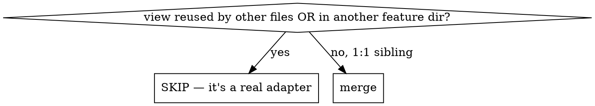

# Merge Pass-Through Containers

## Overview

A **pass-through container** is leftover redux-era ceremony: a component that
calls store hooks, assembles a plain `props` object, and renders exactly one
sibling **view** component — adding no JSX of its own. Now that views use Zustand
hooks directly, the container/view split is pure indirection. Fold the container
into the view: one file, one component.

**Core principle:** if the container renders `<View {...props}/>` (self-closing,
no children) and nothing else, the hook + derivation belongs in the view.

## The signature

```tsx
// foo-container.tsx  ← pass-through
const FooContainer = (ownProps: OwnProps) => {
  const row = useSomeStore(ownProps.id)        // hooks
  const derived = mapStuff(row, ownProps)      // derivation
  const props = {a, b, c}                       // assemble
  return <Foo {...props} />                     // render ONE sibling view, self-closing
}
export default FooContainer
```

A component that renders `<Wrapper>…children…</Wrapper>` (has children) or
composes primitives (`<UserNotice><Text/></UserNotice>`) is a real view — **not**
a pass-through. Leave it.

## Find candidates

Run from `shared/` (so `typescript` resolves):

```bash
node ../.claude/skills/merge-passthrough-containers/scripts/find-passthrough-containers.mts <dir>
```

`<dir>` is relative to `shared/` (e.g. `chat/inbox`, `login`, or `.` for all).
Output flags each candidate with: the view it renders, whether that view is a
sibling, how many other files import the view, and how many import the container.

## Process (per candidate)



1. **Verify 1:1.** The view must be a sibling (`.` / `./…`) imported by no one
   else. If the script reports `view reused by: >0` or `sibling-view: false`,
   STOP — it's a genuine adapter; merging would change other call sites.
2. **Check stories/tests.** If a `*.stories.tsx`/`*.test.tsx` feeds the view
   props directly, keep it props-only (skip, or merge into a `*Impl` inner). The
   script does not scan these — grep yourself.
3. **Merge.** Move the container's hooks + derivation into the view component.
   Replace the view's presentational `Props` with the container's `OwnProps`;
   compute the old props locally. Keep the JSX body untouched (assemble a local
   `props` object if that minimizes edits).
4. **Delete** the container file (`git rm`).
5. **Repoint** every importer of the container to the view's path.
6. **Validate:** from `shared/`, `yarn lint && yarn tsc`. Remove any now-unused
   imports/types the container left behind.

## When NOT to merge

- View is reused by another file (shared component) — merging couples them.
- View lives in a different feature dir (cross-feature adapter is legitimate).
- Container has a story/test that depends on the view being pure props-only.
- The "container" actually renders its own JSX/children — it's a view already.

## Common mistakes

| Mistake | Fix |
|---|---|
| Merging a shared view used elsewhere | Check `view reused by` count first; SKIP if >0. |
| Forgetting an importer | Repoint ALL container importers (script reports the count). |
| Leaving dead code | Drop the old presentational `Props` type + unused imports. |
| Dropping a guard/branch | Preserve early `return null` and conditional render logic verbatim. |
| Trusting the script blindly | It flags candidates; you decide. Read both files before merging. |
