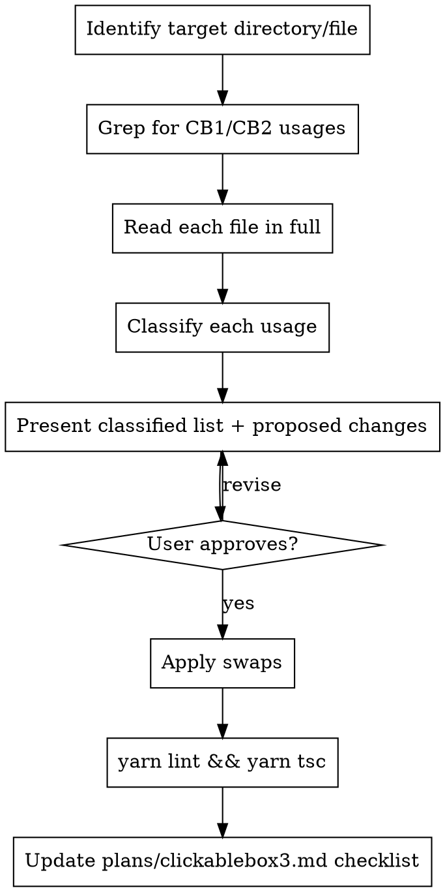

# Migrate ClickableBox / ClickableBox2 → ClickableBox3

See `plans/clickablebox3.md` for the full migration plan, directory checklist, and completion criteria.

## What is ClickableBox3?

`ClickableBox3` = `ClickableBox2` + all `Box2` layout props (direction optional). On desktop it renders a `<div>` with the Box2 CSS class system plus `clickable-box2` cursor. On mobile it uses `Pressable` + `box2SharedProps` for layout.

Type: `Box2Props & {onClick?, onLongPress?, hitSlop?}` — **`direction` is required.**

`Box2Props` includes desktop mouse events: `onMouseDown`, `onMouseUp`, `onMouseLeave`, `onMouseMove`, `onMouseOver`, `onMouseEnter`, `onContextMenu`. CB3 passes all of these through to the desktop `<div>`. They are **not** forwarded on mobile (Pressable doesn't support them).

`direction` is always required. For Pattern B swaps (plain clickable wrapper, no layout needed), pass the direction that matches how children are stacked — usually `"vertical"` for a single child or vertically-stacked children.

## Process



## Step 1: Find Usages

From `shared/`:
```
grep -n "ClickableBox[^3]" <target-dir>/*.tsx
```

Read each matched file fully before classifying.

## Step 2: Classify Each Usage

### Pattern A — CB wraps an immediate Box2 (most common, biggest win)

```tsx
<Kb.ClickableBox onClick={...}>
  <Kb.Box2 direction="horizontal" fullWidth alignItems="center" style={...}>
    ...
  </Kb.Box2>
</Kb.ClickableBox>
```

**Action:** Merge into one `ClickableBox3`. Move all Box2 props up, remove the Box2 wrapper.

```tsx
<Kb.ClickableBox3 onClick={...} direction="horizontal" fullWidth alignItems="center" style={...}>
  ...
</Kb.ClickableBox3>
```

### Pattern B — CB with only click props, no style

```tsx
<Kb.ClickableBox onClick={...}>
  <SomeOtherContent />
</Kb.ClickableBox>
```

**Action:** Swap to CB3. Always provide `direction`. Add `fullWidth={true}` if the original CB was filling its parent's width (e.g., list rows, banners, full-width wrappers).

```tsx
<Kb.ClickableBox3 onClick={...} direction="vertical" fullWidth={true}>
  <SomeOtherContent />
</Kb.ClickableBox3>
```

**⚠️ `box2_centered` / `alignSelf: center` gotcha:** CB3 applies `align-self: center` (desktop: `box2_centered` CSS class; mobile: `nativeStyles.centered = {alignSelf: 'center'}`) whenever neither `fullWidth` nor `fullHeight` is set. CB1 did NOT do this. This affects **both platforms**. If the original CB was expected to fill its parent (e.g. list rows, banners, full-width wrappers), omitting `fullWidth={true}` will shrink it to content-width. Always check the parent layout context — when in doubt, add `fullWidth={true}`.

### Pattern C — CB with style that encodes flex layout

```tsx
<Kb.ClickableBox onClick={...} style={styles.row}>
// where row = { ...Kb.Styles.globalStyles.flexBoxRow, alignItems: 'center', ... }
```

**Action:** Move flex properties to CB3 props; keep non-flex properties in the style object.

```tsx
<Kb.ClickableBox3 onClick={...} direction="horizontal" alignItems="center" style={styles.row}>
// row simplifies to: { height: ..., padding: ... }  — remove flexBoxRow, centered(), position:'relative'
```

See Style Cleanup section below.

### Pattern D — CB with props not in CB3 (rare)

These CB1 props have no CB3 equivalent:
- `hoverColor`, `underlayColor` → add `hover_background_color_*` CSS className to CB3 instead
- `feedback={false}` → drop (Pressable doesn't have this)
- `activeOpacity` → drop
- `onPressIn` / `onPressOut` → not in CB3; leave as CB1 and note it
- `tooltip` → wrap with `<Kb.WithTooltip>` outside CB3
- `onLongPress={(e) => ...}` → remove the `e` param (CB3 signature is `() => void`)

Note: `onMouseDown`, `onMouseUp`, `onMouseLeave`, `onMouseMove`, `onMouseOver`, `onMouseEnter` are **fully supported** in CB3 via `Box2Props` — these are NOT Pattern D cases.

## Step 3: Present Changes Before Touching Anything

For each usage show: file, line, pattern (A/B/C/D), proposed change.
Flag any D cases and ask before acting. Wait for approval.

## Step 4: Apply Swaps

1. Replace `Kb.ClickableBox` / `Kb.ClickableBox2` → `Kb.ClickableBox3`
2. When merging an inner Box2 (Pattern A): move its props to CB3, delete the Box2 opening and closing tags
3. Simplify styles where flex props moved to CB3 props (Pattern C)
4. Remove now-unused imports if CB1/CB2 fully replaced in file

## Step 5: Validate

From `shared/`:
```
yarn lint && yarn tsc
```
Fix errors before reporting done.

## Step 6: Update Checklist

Mark the completed directory in `plans/clickablebox3.md`.

---

## Style Cleanup (Pattern C)

When CB3 takes over flex layout via props, remove these from the style object passed to CB3:

### Desktop (Electron) — safe to remove when CB3 handles them via props

| Style pattern | CB3 prop replacement |
|---|---|
| `...Kb.Styles.globalStyles.flexBoxRow` | `direction="horizontal"` |
| `...Kb.Styles.globalStyles.flexBoxColumn` | `direction="vertical"` |
| `...Kb.Styles.centered()` (`alignItems+justifyContent: center`) | `centerChildren={true}` |
| `position: 'relative'` | `relative={true}` |
| `alignItems: 'center'` | `alignItems="center"` |
| `width: '100%'` / `maxWidth: '100%'` | `fullWidth={true}` |
| `height: '100%'` | `fullHeight={true}` |
| `flex: 1` | `flex={1}` |

Keep in the style object: fixed `height`, `width` values, `padding`, `margin`, `borderRadius`, `backgroundColor`, `border*`, and anything not covered by a CB3/Box2 prop.

### Mobile (React Native)

`flexBoxRow` / `flexBoxColumn` on RN expand to only `{flexDirection: 'row/column'}` — no `display:flex` (RN doesn't use it). RN flex layout is unchanged between CB2 and CB3 when direction is provided.

CB3 on RN does NOT add `borderRadius: 3` (CB1's old default). Remove it from styles only if it was purely inherited from CB1, not a design intent.

### Note: `direction` is required in CB3

Always pass `direction`. For plain wrapper cases (Pattern B) with no layout need, use `"vertical"` as the default. Remember to add `fullWidth={true}` if the element should fill its parent.

## What NOT to Do

- Don't swap cases where `onPressIn`/`onPressOut` is required — leave as CB1, note it
- Don't add hover CSS classes for colors not already in the design system — ask first
- Don't change surrounding logic, navigation, or state — component swap only
- Don't remove CB1/CB2 exports until the full migration is complete
