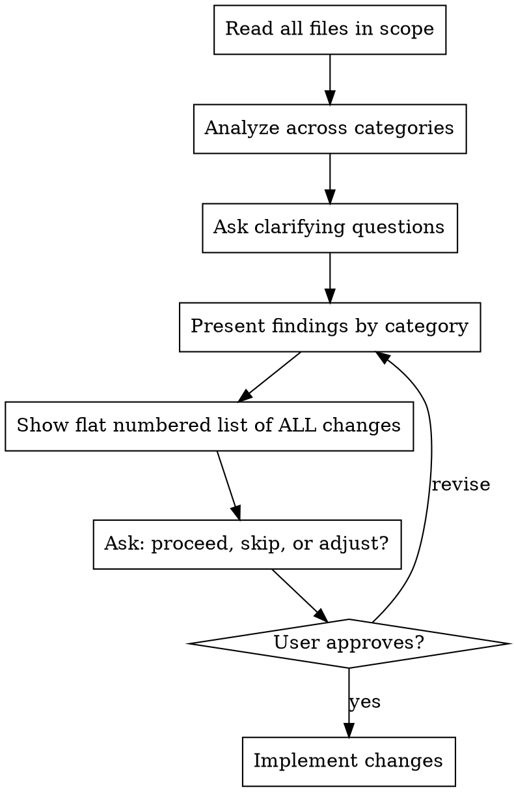

# Simplify UI Section

## Overview

Good UI code is easy to read, has clear boundaries, and doesn't repeat itself. This skill is a structured approach to identifying and fixing structural problems in a group of related files.

**Core principle:** Read everything first, analyze thoroughly, ask before touching.

## Process



## Step 1: Read Everything First

Read **every file** in scope before forming opinions. Patterns only become visible across the full picture.

## Step 2: Analyze Across These Categories

### Duplications
- Same function/logic copy-pasted across files (especially data-transformation helpers, icon-resolution, RPC mapping)
- Same inline component repeated in multiple places
- Same style values repeated without a shared constant

### File Organization
- Tiny files (< 50 lines) that only export to one or two consumers — candidate for folding
- Files too large for their single responsibility — candidate for splitting
- Import directions that feel backwards (e.g., a detail screen importing from a list screen)

### Naming
- Generic component names (`Container`, `Wrapper`, `Inner`) — rename to what they actually are
- Exported symbols named differently from their file (`export default Container` from `row.tsx`)
- Context/hooks defined in a file that doesn't own them

### Component Hierarchy
- Wrapper components that add no logic — eliminate the layer
- Components split across files for no structural reason — candidate for collocating
- Deeply nested JSX that could flatten via composition

### Props and Styles
- Components with large prop lists where many props just pass through — consider composition or context
- Repeated style patterns across components that could become a shared style helper or `Kb.Styles` utility call
- Platform-conditional logic repeated in multiple components instead of being handled once
- Styles inlined at call sites instead of in the stylesheet

### Shared Helpers and Components
- Patterns used 2+ times that have no shared abstraction
- Icon resolution logic duplicated across screens
- Small display components (badges, labels, markers) defined inline multiple times

## Step 3: Ask Before Acting

Before presenting findings, ask these if the answers aren't obvious from the code:

1. **External consumers**: Are there files outside this directory importing these? (affects what can be renamed or removed)
2. **Off-limits files**: Any files that should not be changed?
3. **New files**: Is adding a new file for deduplication okay, or prefer keeping file count flat/lower?
4. **Priority**: Any specific problem the user wants addressed most?

## Step 4: Present ALL Findings and Get Approval

**Do not touch any file until the user has seen and approved the full list.**

Group findings clearly by category. For each item include:
- What the problem is
- What the fix would be
- Any tradeoff or risk (e.g., circular import risk if moving a context)

End with an explicit summary: a flat numbered list of every proposed change, then ask the user to confirm scope before proceeding. Example:

> **Proposed changes (7 total):**
> 1. Rename `rpcDeviceToDevice` → `rpcDeviceDetailToDevice` in `rpc.tsx` and callers
> 2. Fold `rpc.tsx` into `index.tsx`; update `device-revoke.tsx` import
> 3. Refactor `getDeviceIconType` to take `(type, iconNumber, size, current?)` instead of full device
> 4. ...
>
> Shall I proceed with all of these, or adjust scope?

Wait for the user's response. Do not begin any edits until they reply.

## Step 5: Implement

Make all approved changes. Remove unused imports, styles, and variables left behind. Run lint and tsc after.

## The Hard Line: No Behavior Changes

**This skill is structural only. Zero visual, UX, or behavior changes — ever.**

This means:
- No changes to rendered output, layout, spacing, or colors
- No changes to user-visible text, labels, or copy
- No changes to interaction flows, navigation, or state logic
- No "small improvements" to UX while you're in there
- No refactoring component logic even if it looks equivalent

If a simplification would change any of these things, **stop and discuss it first**. It is not in scope until the user explicitly validates it.

The only exception: if a behavior change is required to fix an outright bug discovered during the review. Raise it separately; do not bundle it with structural changes.

## Shared Helpers: Use `common.tsx`

When two or more files in the same feature folder need a shared helper (data-mapping, RPC conversion, icon resolution, etc.), consolidate into a `common.tsx` in that folder.

**Do not put shared helpers in the feature's `index.tsx`** — sub-views importing from the feature index creates a backwards dependency direction that will cause circular import problems as the feature grows.

```
devices/
  common.tsx       ← shared helpers (rpcDeviceDetailToDevice, etc.)
  index.tsx        ← imports from common.tsx
  device-revoke.tsx ← imports from common.tsx
  device-page.tsx
  ...
```

This pattern generalises: use `common.tsx` as the name regardless of feature folder. Other typical names like `utils.tsx` or `helpers.tsx` are acceptable if a project already uses them consistently.

## What NOT to Do

- Don't propose changes that require understanding runtime behavior (don't guess at logic equivalence)
- Don't add new abstractions unless there are 2+ concrete uses already
- Don't move things that would create circular imports
- Don't rename exports that have external consumers without confirming first
- Don't collapse files that serve genuinely different concerns just because they're small
- Don't put shared helpers in `index.tsx` — sub-views importing from the feature index creates backwards dependencies
