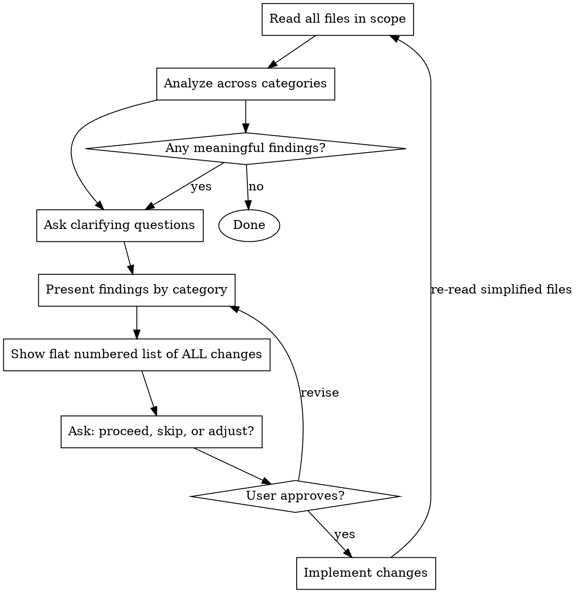

# Simplify UI Section

## Overview

Good UI code is easy to read, has clear boundaries, and doesn't repeat itself. This skill is a structured approach to identifying and fixing structural problems in a group of related files.

**Core principle:** Read everything first, analyze thoroughly, ask before touching.

## Process



## Step 1: Read Everything First

Read **every file** in scope before forming opinions. Patterns only become visible across the full picture.

## Step 2: Analyze Across These Categories

### Duplications
- Same function/logic copy-pasted across files (especially data-transformation helpers, icon-resolution, RPC mapping)
- Same inline component repeated in multiple places
- Same style values repeated without a shared constant

### File Organization
- Tiny files (< 50 lines) that only export to one or two consumers — candidate for folding
- Files too large for their single responsibility — candidate for splitting
- Import directions that feel backwards (e.g., a detail screen importing from a list screen)

### Naming
- Generic component names (`Container`, `Wrapper`, `Inner`) — rename to what they actually are
- Exported symbols named differently from their file (`export default Container` from `row.tsx`)
- Context/hooks defined in a file that doesn't own them

### Component Hierarchy
- Wrapper components that add no logic — eliminate the layer
- Components split across files for no structural reason — candidate for collocating
- Deeply nested JSX that could flatten via composition

### Nested Boxes (high-signal smell)

Two or more `Box2` (or `Kb.Box2`) components nested directly inside each other is a reliable sign something can be simplified. When you see this pattern, investigate:

- **Redundant wrapper**: the outer box exists only to pass a `style` or `direction` that the inner box could absorb — collapse them into one
- **Props can merge**: both boxes carry layout props (`alignItems`, `gap`, `fullWidth`, etc.) with no conflicting values — merge onto a single box
- **Composition opportunity**: the nesting reflects a structural concern (header + body) that could be expressed as named sub-components instead of anonymous nested boxes
- **Unnecessary intermediate container**: an outer box wraps a single child box with no additional siblings or layout purpose — remove the outer layer

A long chain of `<Box2><Box2><Box2>` almost always means something went wrong at the design level. Trace back to why each layer exists before proposing a fix; the root cause is usually one of the above.

### Props and Styles
- Components with large prop lists where many props just pass through — consider composition or context
- Repeated style patterns across components that could become a shared style helper or `Kb.Styles` utility call
- Platform-conditional logic repeated in multiple components instead of being handled once
- Styles inlined at call sites instead of in the stylesheet
- Style properties that can be replaced with Box2 props (see **Box2 Props** section below)

### Shared Helpers and Components
- Patterns used 2+ times that have no shared abstraction
- Icon resolution logic duplicated across screens
- Small display components (badges, labels, markers) defined inline multiple times

## Box2 Props: Replace Style Properties

`Kb.Box2` (and `Box2`) has first-class props for many layout properties. When a Box2's style object contains properties that have a prop equivalent, move them out of the style and into the prop. This shrinks stylesheets and makes intent more readable.

### Pure structural replacements (no visual change — do freely)

These are exact equivalents. Moving them from style to prop changes nothing visible.

| Style property | Box2 prop |
|---|---|
| `alignItems: 'center'` | `alignItems="center"` |
| `alignItems: 'flex-start'` | `alignItems="flex-start"` |
| `alignItems: 'flex-end'` | `alignItems="flex-end"` |
| `alignItems: 'stretch'` | `alignItems="stretch"` |
| `alignSelf: 'center'` | `alignSelf="center"` |
| `alignSelf: 'flex-start'` | `alignSelf="flex-start"` |
| `alignSelf: 'flex-end'` | `alignSelf="flex-end"` |
| `alignSelf: 'stretch'` | `alignSelf="stretch"` |
| `justifyContent: 'center'` | `justifyContent="center"` |
| `justifyContent: 'space-between'` | `justifyContent="space-between"` |
| `justifyContent: 'flex-start'` | `justifyContent="flex-start"` |
| `justifyContent: 'flex-end'` | `justifyContent="flex-end"` |
| `justifyContent: 'space-around'` | `justifyContent="space-around"` |
| `justifyContent: 'space-evenly'` | `justifyContent="space-evenly"` |
| `alignItems: 'center', justifyContent: 'center'` | `centerChildren` |
| `width: '100%'` | `fullWidth` |
| `height: '100%'` | `fullHeight` |
| `flexShrink: 0` | `noShrink` |
| `flex: 1` | `flex={1}` |
| `overflow: 'hidden'` | `overflow="hidden"` |
| `position: 'relative'` | `relative` |
| `padding: Styles.globalMargins.small` | `padding="small"` (uniform padding only) |

`padding` accepts any `globalMargins` key: `xxtiny` `xtiny` `tiny` `xsmall` `small` `medium` `mediumLarge` `large` `xlarge`. Only use when padding is uniform on all sides; don't use if sides differ.

After moving props out, if the style object becomes empty (`style={{}}`), remove the style prop entirely.

### Gap prop: replaces per-child margins (validate first)

`gap="small"` on a `Box2` inserts space **between** children using CSS `columnGap`/`rowGap`. This replaces the pattern of putting `marginTop`/`marginLeft`/`marginBottom`/`marginRight` on each child.

`gap` accepts any `globalMargins` key. The spacing value must match a globalMargins token; if the existing margin is a raw number, check against the table above (e.g., `4 → xtiny`, `8 → tiny`, `16 → small`).

**This is a slight visual change:** gap does not add space before the first child or after the last, while per-child margins typically do (at least on one end). Use `gapStart` and/or `gapEnd` to restore leading/trailing padding if needed.

```tsx
// Before
const styles = Kb.Styles.styleSheetCreate(() => ({
  child: {marginBottom: Kb.Styles.globalMargins.small},
}))
<Kb.Box2 direction="vertical">
  <Child style={styles.child} />
  <Child style={styles.child} />
</Kb.Box2>

// After
<Kb.Box2 direction="vertical" gap="small">
  <Child />
  <Child />
</Kb.Box2>
```

**Always flag gap conversions in the proposed-changes list** and note the visual implication (edge spacing removed). The user decides whether to accept. Don't bundle them silently with structural changes.

### When gap doesn't apply

- Spacing between only *some* siblings (not all) — gap is all-or-nothing
- Children that individually need different margins from each other
- Raw pixel values that don't map to any globalMargins token
- Margins used to push a single element away from something unrelated to sibling spacing

## Step 3: Ask Before Acting

Before presenting findings, ask these if the answers aren't obvious from the code:

1. **External consumers**: Are there files outside this directory importing these? (affects what can be renamed or removed)
2. **Off-limits files**: Any files that should not be changed?
3. **New files**: Is adding a new file for deduplication okay, or prefer keeping file count flat/lower?
4. **Priority**: Any specific problem the user wants addressed most?

## Step 4: Present ALL Findings and Get Approval

**Do not touch any file until the user has seen and approved the full list.**

Group findings clearly by category. For each item include:
- What the problem is
- What the fix would be
- Any tradeoff or risk (e.g., circular import risk if moving a context)

End with an explicit summary: a flat numbered list of every proposed change, then ask the user to confirm scope before proceeding. Example:

> **Proposed changes (7 total):**
> 1. Rename `rpcDeviceToDevice` → `rpcDeviceDetailToDevice` in `rpc.tsx` and callers
> 2. Fold `rpc.tsx` into `index.tsx`; update `device-revoke.tsx` import
> 3. Refactor `getDeviceIconType` to take `(type, iconNumber, size, current?)` instead of full device
> 4. ...
>
> Shall I proceed with all of these, or adjust scope?

Wait for the user's response. Do not begin any edits until they reply.

## Step 5: Implement

Make all approved changes. Remove unused imports, styles, and variables left behind. Run lint and tsc after.

## Step 6: Iterate

**Simplification is not a single pass.** After implementing changes, the simplified code often reveals new opportunities that were hidden by the original clutter. Always do at least one more pass.

Go back to **Step 1** and re-read all files in scope. Then repeat Steps 2–5 with fresh eyes.

**Stop iterating when:** a full pass produces no meaningful findings — every category comes up empty or yields only borderline cases the user opts to skip.

**Never stop after the first pass.** The first pass removes the obvious problems. The second pass finds what those problems were hiding. The third pass is usually final.

## Revisiting Previously Simplified Directories

**Re-running this skill on already-simplified code is intentional and by design.** Do not skip a directory just because it appears in recent git history as "already simplified."

Each simplification pass changes the landscape. What looked acceptable before may now be a smell. New patterns emerge as nearby code changes. The second run almost always finds something the first missed.

When asked to simplify a directory that was previously touched: proceed without hesitation. Read fresh, analyze fresh.

## The Hard Line: No Unilateral Visual Changes

**This skill is structural by default. Zero UX or behavior changes without explicit user sign-off.**

This means:
- No changes to user-visible text, labels, or copy
- No changes to interaction flows, navigation, or state logic
- No "small improvements" to UX while you're in there
- No refactoring component logic even if it looks equivalent

**Visual changes require validation first.** Flag them clearly in the proposed-changes list with a note like "(slight visual: removes trailing gap between last child and container edge)". The user decides whether to accept. Wait for approval before implementing.

The one named exception: `gap` conversions (replacing per-child margins with Box2 `gap`). These are small but real visual changes. Always list them separately in the proposal so the user can opt in or out per case.

If a behavior change is required to fix an outright bug discovered during the review, raise it separately — do not bundle it with structural changes.

## Shared Helpers: Use `common.tsx`

When two or more files in the same feature folder need a shared helper (data-mapping, RPC conversion, icon resolution, etc.), consolidate into a `common.tsx` in that folder.

**Do not put shared helpers in the feature's `index.tsx`** — sub-views importing from the feature index creates a backwards dependency direction that will cause circular import problems as the feature grows.

```
devices/
  common.tsx       ← shared helpers (rpcDeviceDetailToDevice, etc.)
  index.tsx        ← imports from common.tsx
  device-revoke.tsx ← imports from common.tsx
  device-page.tsx
  ...
```

This pattern generalises: use `common.tsx` as the name regardless of feature folder. Other typical names like `utils.tsx` or `helpers.tsx` are acceptable if a project already uses them consistently.

## What NOT to Do

- Don't propose changes that require understanding runtime behavior (don't guess at logic equivalence)
- Don't add new abstractions unless there are 2+ concrete uses already
- Don't move things that would create circular imports
- Don't rename exports that have external consumers without confirming first
- Don't collapse files that serve genuinely different concerns just because they're small
- Don't put shared helpers in `index.tsx` — sub-views importing from the feature index creates backwards dependencies
- Don't rename `.tsx` files to `.ts` — JSX may be added later and the extension signals component-adjacent code
